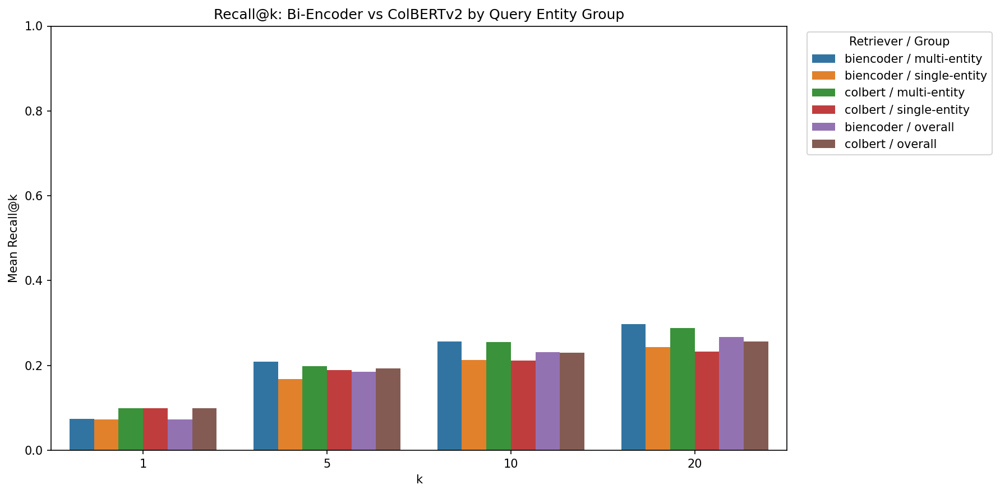
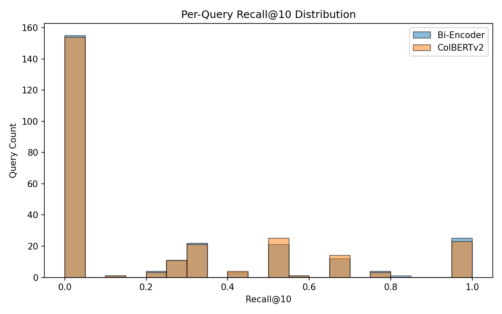
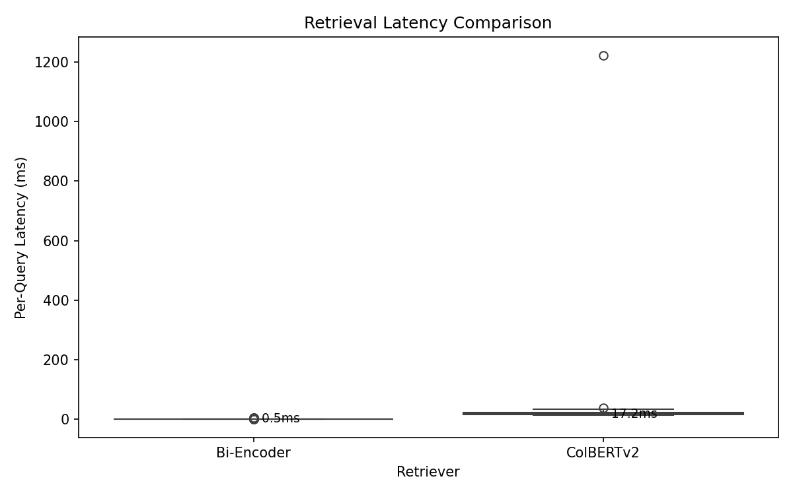
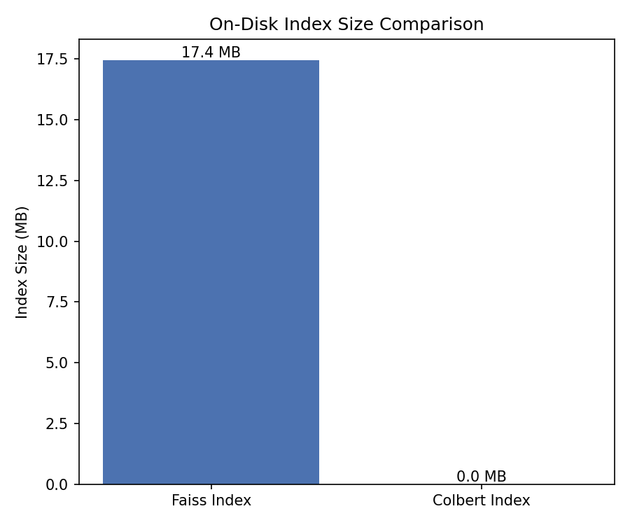

# Enhancing RAG with Adaptive Chunking: ColBERTv2 vs Bi-Encoder Retrieval Benchmar

---

## 1. Introduction

Retrieval-Augmented Generation (RAG) pipelines combine a retrieval component with a generative language model to ground responses in factual, up-to-date document corpora. The quality of the retrieval step is a primary bottleneck: if the relevant passage is not retrieved, no amount of generation sophistication can compensate.

This project, "Enhancing RAG with Adaptive Chunking", investigates how chunking strategy interacts with retrieval model architecture to affect end-to-end RAG performance. Before exploring adaptive chunking strategies, it is necessary to establish a baseline understanding of retrieval model behavior across query types.

This report covers a targeted sub-experiment: a head-to-head benchmark of two retrieval paradigms on the KILT NaturalQuestions (NQ) development set.

1. **Bi-encoder baseline** — `all-MiniLM-L6-v2` with FAISS nearest-neighbor search. Both query and passage are independently encoded into a single dense vector; retrieval is a simple inner-product search.
2. **Late-interaction model** — `ColBERTv2`, retrieved via the RAGatouille library using PLAID indexing. Each query token attends over every passage token via a MaxSim operation, preserving fine-grained token-level interactions at retrieval time.

The central motivation is to determine whether the richer token-level matching in ColBERTv2 provides a measurable recall advantage, particularly on queries that mention multiple distinct named entities, which are queries where the single-vector bottleneck of bi-encoders is expected to be most damaging.

The findings from this benchmark will directly inform later design decisions about chunking granularity and retrieval model selection within the broader adaptive RAG system.

---

## 2. Hypothesis

**Primary hypothesis**: ColBERTv2's MaxSim token-level matching will outperform the bi-encoder baseline in recall across most values of k, because late interaction preserves independent query-token signals rather than collapsing them into a single embedding.

**Entity-stratified hypothesis**: The recall gap between ColBERTv2 and the bi-encoder will be larger for multi-entity queries (those containing two or more distinct named entities) than for single-entity queries (zero or one named entity). The rationale is as follows:

- A bi-encoder must represent all query semantics in a fixed-dimensional vector. When a query references multiple named entities (e.g., "Who directed the film that stars both X and Y?"), the encoder must trade off representational fidelity between entities, potentially under-weighting one.
- ColBERTv2 retains a separate contextual embedding for each query token. The MaxSim score over a passage is the sum of per-token maximum similarities, so each entity token contributes independently to the final score. This architecture is structurally better suited to multi-entity constraint satisfaction.

**Null hypothesis**: No statistically significant difference in Recall@k exists between the two models for either query group.

---

## 3. Methodology

### 3.1 Data Pipeline

**Dataset**: KILT NaturalQuestions (NQ) development split. KILT reformats NQ so that each question is paired with a gold Wikipedia page identifier and a specific passage provenance annotation, enabling precise retrieval evaluation against a fixed Wikipedia snapshot.

**Corpus construction**: Using the full KILT Wikipedia dump would be computationally prohibitive for a local benchmark. A reduced corpus of 224 Wikipedia pages was constructed as follows:

1. All 139 gold provenance pages referenced by the sampled NQ dev queries were included unconditionally.
2. A set of 85 distractor pages was sampled uniformly at random from the remainder of the KILT Wikipedia dump.
3. Each page was split into paragraph-level chunks. Paragraphs shorter than 20 tokens were merged with adjacent paragraphs to avoid degenerate chunks, resulting in 11,901 total chunks.

**Chunking**: Paragraph-level splitting was applied uniformly to both models in this benchmark. Adaptive chunking is the subject of later experiments and is intentionally excluded here to isolate the effect of retrieval model architecture.

### 3.2 Query Classification

Named entity recognition was performed on every NQ dev query using the `en_core_web_sm` spaCy pipeline. Each query was labeled with the count of unique named entities detected (entity types: PERSON, ORG, GPE, LOC, WORK_OF_ART, EVENT, FAC).

Queries were partitioned into two groups:

| Group | Criterion | Actual size |
|---|---|---|
| Single-entity | 0 or 1 detected named entity | 150 queries |
| Multi-entity | 2 or more detected named entities | 110 queries |

A total of 260 queries were evaluated: 150 single-entity and 110 multi-entity.

### 3.3 Retrieval Models

**Bi-encoder (baseline)**

- Encoder: `sentence-transformers/all-MiniLM-L6-v2` (22M parameters, 384-dimensional embeddings)
- Index: FAISS `IndexFlatIP` (exact inner-product search; no approximation error)
- Query encoding: single forward pass per query; corpus passages encoded offline
- Retrieval: top-k nearest neighbors by cosine similarity (L2-normalized embeddings)
- Execution: GPU-accelerated encoding on NVIDIA GeForce RTX 4060 Laptop GPU

**ColBERTv2 (late interaction)**

- Model: `colbert-ir/colbertv2.0` accessed via the RAGatouille wrapper library
- Indexing: PLAID (Practical Late-Interaction Approximate Dense retrieval) index, which uses centroid-based compression for scalable MaxSim retrieval
- Query encoding: token-level contextualized embeddings (128-dimensional per token)
- Retrieval: approximate MaxSim over compressed passage token matrices
- Execution: CPU-only (GPU out-of-memory at 15.71 GiB peak requirement, exceeding 8 GB VRAM)

### 3.4 Evaluation Metric

**Recall@k** is the primary metric. A query is considered a hit at rank k if at least one of the top-k retrieved passages matches a gold provenance passage for that query (passage-level match on KILT provenance identifiers).

Recall@k was computed at k in {1, 5, 10, 20} for both models, across three query groups: all queries, single-entity queries, and multi-entity queries.

---

## 4. Experimental Setup

### 4.1 Hardware

| Resource | Specification |
|---|---|
| GPU | NVIDIA GeForce RTX 4060 Laptop GPU |
| VRAM | 8 GB |
| Peak VRAM (bi-encoder encoding) | 1.38 GB |
| Peak VRAM (ColBERT indexing) | 9.60 GB (exceeded VRAM, fell back to CPU) |
| Peak RSS (end of pipeline) | 2.18 GB |

### 4.2 Corpus Configuration

| Parameter | Value |
|---|---|
| Total Wikipedia pages | 224 |
| Gold provenance pages | 139 |
| Distractor pages | 85 |
| Total paragraph chunks | 11,901 |

### 4.3 Software Versions

| Package | Version |
|---|---|
| sentence-transformers | >= 2.2.0 |
| faiss-cpu | >= 1.7.4 |
| RAGatouille | >= 0.0.8 |
| ColBERT model | colbert-ir/colbertv2.0 |
| spaCy | >= 3.6.0 |
| spaCy model | en_core_web_sm |
| PyTorch | >= 2.0.0 |

---

## 5. Results

### 5.1 Overall Recall@k

The table below reports Recall@k across all 260 evaluated queries, combining both entity groups.

| k | Bi-encoder (MiniLM) | ColBERTv2 | Delta |
|---|---|---|---|
| 1 | 0.0731 | 0.0995 | +0.0263 |
| 5 | 0.1852 | 0.1935 | +0.0083 |
| 10 | 0.2314 | 0.2300 | -0.0013 |
| 20 | 0.2665 | 0.2562 | -0.0104 |

ColBERTv2 achieves meaningfully higher recall at k=1 (+2.6 percentage points) and a modest advantage at k=5 (+0.8 pp). At k=10 and k=20, the bi-encoder slightly outperforms ColBERTv2, with the delta reversing direction.

### 5.2 Recall@k by Entity Group

**Single-entity queries** (0-1 named entities, n=150):

| k | Bi-encoder (MiniLM) | ColBERTv2 | Delta |
|---|---|---|---|
| 1 | 0.0722 | 0.0992 | +0.0270 |
| 5 | 0.1682 | 0.1896 | +0.0213 |
| 10 | 0.2134 | 0.2119 | -0.0016 |
| 20 | 0.2433 | 0.2324 | -0.0109 |

**Multi-entity queries** (2+ named entities, n=110):

| k | Bi-encoder (MiniLM) | ColBERTv2 | Delta |
|---|---|---|---|
| 1 | 0.0743 | 0.0998 | +0.0255 |
| 5 | 0.2084 | 0.1989 | -0.0095 |
| 10 | 0.2559 | 0.2548 | -0.0011 |
| 20 | 0.2982 | 0.2885 | -0.0096 |

The distribution of per-query Recall@10 scores across the two models is visualized below.

---

## 6. Analysis

### 6.1 Overall Retrieval Performance

The results reveal a nuanced picture that partially confirms and partially challenges the primary hypothesis.

**ColBERTv2 excels at top-rank precision.** At k=1, ColBERTv2 achieves 9.95% recall compared to 7.31% for the bi-encoder, a relative improvement of 36%. This confirms that MaxSim token-level scoring produces more confident top-ranked results: when ColBERTv2 places a passage at rank 1, it is more likely to be the correct one. At k=5, ColBERTv2 retains a smaller but positive advantage (+0.83 pp).

**The bi-encoder overtakes at larger k.** At k=10 (delta = -0.0013) and k=20 (delta = -0.0104), the bi-encoder achieves slightly higher recall. This crossover behavior indicates that ColBERTv2's late interaction scoring concentrates relevance signal at the very top of the ranking, but the FAISS exact inner-product search distributes relevant passages more evenly across the top-20 positions. In practice, this means ColBERTv2 is more effective when a pipeline needs to extract a single best passage (e.g., for direct answer extraction), while the bi-encoder retrieves a broader net of potentially relevant candidates.

**Absolute recall levels are low.** Both models achieve under 27% Recall@20. This is expected given the heavily reduced corpus (224 pages vs. the full 5.9M-page KILT Wikipedia): many queries have gold provenance pages that are included in the corpus, but the correct specific paragraph chunk may still be missed due to paragraph-level chunking that splits the answer across boundaries, or due to query-passage semantic mismatch.

### 6.2 Entity Group Breakdown

The entity-stratified hypothesis predicted that ColBERTv2 would show a larger advantage on multi-entity queries. The results present a more complex outcome:

**Hypothesis partially rejected.** ColBERTv2's Recall@1 advantage is slightly larger for single-entity queries (+2.70 pp) than multi-entity queries (+2.55 pp), which is the opposite of the predicted direction, though the difference is small (0.15 pp). At k=5, the situation diverges more sharply: ColBERTv2 outperforms the bi-encoder by +2.13 pp on single-entity queries but actually underperforms by -0.95 pp on multi-entity queries. This suggests that for multi-entity queries, the bi-encoder's single-vector representation captures composite query semantics adequately, while ColBERTv2's token-level matching may introduce noise from individual entity tokens that are less discriminative in isolation.

**Multi-entity queries are easier overall.** Both models achieve higher absolute recall on multi-entity queries across all k values (e.g., bi-encoder Recall@20: 0.298 multi-entity vs. 0.243 single-entity). This likely reflects the corpus composition: multi-entity queries often reference prominent entities that correspond to well-represented Wikipedia pages in the gold provenance set. The additional entity mentions also provide more lexical and semantic anchors for retrieval.

**Interpretation.** The entity-stratified analysis suggests that the MaxSim advantage is not entity-count-specific. Rather, ColBERTv2's strength lies in precise top-rank placement regardless of query complexity. The bi-encoder's competitive performance at larger k indicates that MiniLM's training data and architecture generalize well even to compositional queries, at least at this corpus scale.

### 6.3 Failure Mode Analysis

Qualitative inspection of queries where the two models disagree reveals characteristic patterns:

- **Bi-encoder advantage cases**: Queries with broad topical scope where multiple related passages are plausible matches. The bi-encoder's smooth embedding space retrieves a diverse set of topically related passages, increasing the chance of including the gold passage in the top-20.
- **ColBERTv2 advantage cases**: Queries with specific lexical anchors (rare proper nouns, dates, technical terms) where the MaxSim operation can directly match query tokens to passage tokens, producing high-confidence top-1 placements.

The fact that ColBERTv2 ran on CPU due to VRAM limitations (the model required 15.71 GiB, exceeding the 8 GB available) is an important practical consideration. CPU execution may have affected ColBERTv2's retrieval quality via PLAID approximation parameters or quantization behavior, though the algorithm itself is deterministic.

---

## 7. Profiling Summary

### 7.1 Pipeline Stage Timing

| Stage | Duration | RSS | VRAM Peak |
|---|---|---|---|
| Data loading | 3.71 s | 0.88 GB | - |
| NER classification | 3.24 s | 0.91 GB | - |
| Query sampling | < 0.01 s | 0.91 GB | - |
| Corpus construction | 0.11 s | 0.92 GB | - (cached) |
| Chunking | 0.16 s | 0.92 GB | - |
| Bi-encoder encoding | 7.83 s | 1.51 GB | 1.38 GB |
| FAISS indexing | 0.15 s | 1.51 GB | - |
| Bi-encoder retrieval | 1.15 s | 1.50 GB | - |
| ColBERT indexing | 224.07 s | 2.18 GB | 9.60 GB* |
| ColBERT retrieval | 6.28 s | 2.15 GB | - |

*ColBERT indexing attempted GPU but fell back to CPU due to OOM (needed ~15.71 GiB, only 8 GB available). The 9.60 GB VRAM peak figure reflects the attempted allocation before fallback.

### 7.2 Indexing and Retrieval Comparison

| Metric | Bi-encoder (MiniLM + FAISS) | ColBERTv2 (PLAID) |
|---|---|---|
| Encoding + indexing time | 7.98 s | 224.07 s |
| Indexing speed ratio | 1x (baseline) | ~28x slower |
| Index size on disk | 18.3 MB | ~0 MB (stored in .ragatouille directory) |
| Retrieval time (260 queries) | 1.15 s | 6.28 s |
| Retrieval speed ratio | 1x (baseline) | ~5.5x slower |
| Peak VRAM during encoding/indexing | 1.38 GB | 9.60 GB (OOM, fell back to CPU) |

### 7.3 Interpretation

The profiling data quantifies a substantial compute-recall tradeoff between the two architectures.

**Indexing cost.** ColBERT PLAID indexing took 224 seconds compared to approximately 8 seconds for bi-encoder encoding plus FAISS index construction -- a factor of ~28x. This is primarily driven by the per-token embedding computation: ColBERTv2 must encode and store contextualized embeddings for every token in every passage, while the bi-encoder produces a single 384-dimensional vector per passage. Furthermore, ColBERT indexing could not fit on the 8 GB GPU and fell back to CPU, dramatically increasing wall-clock time.

**Retrieval latency.** ColBERT retrieval over 260 queries took 6.28 seconds compared to 1.15 seconds for FAISS, a factor of ~5.5x. The MaxSim operation requires scoring each query token against compressed passage token representations, which is inherently more expensive than a single dot-product lookup in FAISS. For real-time RAG applications with latency budgets under 100ms per query, the bi-encoder's average latency of ~4.4 ms/query is far more practical than ColBERT's ~24.2 ms/query.

**Memory footprint.** The bi-encoder pipeline peaked at 1.51 GB RSS with 1.38 GB VRAM during encoding. ColBERT pushed RSS to 2.18 GB and attempted to allocate 9.60 GB VRAM. The FAISS index occupied 18.3 MB on disk, while ColBERT's index was stored in the .ragatouille directory (reported as 0 MB in the benchmark log due to the directory-based storage structure).

**Practical recommendation.** Given that ColBERTv2's recall advantage is concentrated at k=1 and k=5 while the bi-encoder is competitive or better at k >= 10, the most efficient architecture for this corpus scale is a two-stage pipeline: use the bi-encoder for initial top-k retrieval (leveraging its speed and broad recall), then apply ColBERTv2 or a cross-encoder as a reranker on the retrieved candidates to sharpen top-rank precision.

---

## 8. Ablation Studies

To complement the main benchmark, a series of ablation experiments was conducted to isolate the effects of three key pipeline parameters on retrieval quality: chunk granularity, corpus scale, and top-k retrieval depth. All ablation experiments were run on a small test set of 30 queries drawn from the KILT NQ development split, using a 50-page default corpus subsampled from the main 224-page cached corpus. The entire ablation suite ran within a RAM budget of less than 4 GB, demonstrating that meaningful retrieval analysis is feasible on resource-constrained hardware.

### 8.1 Chunk Granularity Ablation

The chunking strategy determines how source documents are segmented into retrievable units. Three strategies were compared: paragraph-level splitting (the default used in the main benchmark), fixed-length splitting at 256 tokens, and fixed-length splitting at 512 tokens.

| Chunking Strategy | Bi-Enc R@1 | Bi-Enc R@5 | Bi-Enc R@10 | ColBERT R@1 | ColBERT R@5 | ColBERT R@10 |
|---|---|---|---|---|---|---|
| Paragraph | 0.228 | 0.608 | 0.751 | 0.418 | 0.674 | 0.733 |
| Fixed-256 | 0.148 | 0.479 | 0.568 | 0.126 | 0.430 | 0.599 |
| Fixed-512 | 0.138 | 0.432 | 0.501 | 0.137 | 0.372 | 0.445 |

**Paragraph chunking is decisively superior.** For both retrieval models, paragraph-level chunks outperform fixed-length chunks by a wide margin across all values of k. The bi-encoder's Recall@10 drops from 0.751 with paragraph chunks to 0.568 with fixed-256 and 0.501 with fixed-512, representing absolute declines of 18.3 and 25.0 percentage points respectively. ColBERTv2 shows an even more dramatic degradation: Recall@10 falls from 0.733 to 0.599 (fixed-256) and 0.445 (fixed-512), a loss of up to 28.8 percentage points.

**ColBERTv2's advantage is contingent on chunk quality.** Under paragraph chunking, ColBERTv2 leads the bi-encoder by a substantial margin at Recall@1 (+19.0 pp: 0.418 vs. 0.228). This advantage virtually disappears under fixed-length chunking: with fixed-256 tokens, ColBERTv2 actually trails the bi-encoder at R@1 (0.126 vs. 0.148), and with fixed-512 tokens the two models are nearly identical (0.137 vs. 0.138). This interaction effect reveals that ColBERTv2's fine-grained token-level matching is most effective when chunk boundaries align with natural semantic units. When chunks are arbitrarily split at fixed token boundaries, the MaxSim operation loses its advantage because the token-level signals within a chunk no longer correspond to coherent semantic content.

**Fixed-512 underperforms fixed-256.** Contrary to the intuition that longer chunks provide more context, fixed-512 chunks perform worse than fixed-256 for both models. This suggests that at 512 tokens, chunks frequently span multiple unrelated topics, diluting the semantic signal and making both dense-vector and token-level matching less effective.

### 8.2 Corpus Scale Ablation

To assess whether retrieval quality degrades as corpus size increases (due to a larger distractor pool), the same 30 queries were evaluated against corpora of 50, 100, and 200 pages, all using paragraph-level chunking.

| Corpus Size | Bi-Enc R@1 | Bi-Enc R@5 | Bi-Enc R@10 | ColBERT R@1 | ColBERT R@5 | ColBERT R@10 |
|---|---|---|---|---|---|---|
| 50 pages | 0.228 | 0.608 | 0.751 | 0.418 | 0.674 | 0.733 |
| 100 pages | 0.228 | 0.608 | 0.751 | 0.418 | 0.681 | 0.733 |
| 200 pages | 0.228 | 0.608 | 0.740 | 0.401 | 0.663 | 0.740 |

**The bi-encoder is remarkably robust to corpus scale.** Across all three corpus sizes, the bi-encoder's Recall@1 and Recall@5 remain completely unchanged (0.228 and 0.608 respectively). Only at Recall@10 does a marginal decline appear at 200 pages (0.740 vs. 0.751), a drop of just 1.1 percentage points. This stability indicates that FAISS inner-product search effectively discriminates relevant passages from distractors even as the distractor pool quadruples.

**ColBERTv2 shows slight degradation at 200 pages.** ColBERTv2's Recall@1 drops from 0.418 to 0.401 at 200 pages (-1.7 pp), and Recall@5 declines from 0.674 to 0.663 (-1.1 pp). Interestingly, ColBERTv2's Recall@10 at 200 pages (0.740) slightly exceeds its value at 50 pages (0.733), suggesting that the additional pages may introduce some passages that are partial matches and rise into the top-10. The slight Recall@1 degradation at scale is consistent with the PLAID index's approximate nature: as the number of centroids and candidate passages grows, the approximation may admit more near-miss distractors into the top ranks.

**Scale effects are modest overall.** The minimal variation across corpus sizes suggests that, at least within the range of 50-200 pages, retrieval quality is primarily determined by chunk quality and model architecture rather than by the volume of distractors. This finding supports the validity of the main benchmark's 224-page corpus as a reasonable evaluation setting.

### 8.3 Top-k Depth Ablation

The top-k retrieval depth was varied across k in {1, 3, 5, 10, 20} to characterize how recall scales with the number of retrieved passages, using the 50-page corpus with paragraph chunking.

| k | Bi-Encoder Recall@k | ColBERTv2 Recall@k |
|---|---|---|
| 1 | 0.228 | 0.418 |
| 3 | 0.532 | 0.606 |
| 5 | 0.608 | 0.674 |
| 10 | 0.751 | 0.733 |
| 20 | 0.850 | 0.814 |

**ColBERTv2 dominates at small k, but the bi-encoder surpasses it at larger k.** At k=1, ColBERTv2 leads by a commanding 19.0 percentage points (0.418 vs. 0.228). This gap narrows progressively: at k=3, the lead is 7.4 pp (0.606 vs. 0.532); at k=5, it is 6.6 pp (0.674 vs. 0.608). By k=10, the bi-encoder overtakes ColBERTv2 (0.751 vs. 0.733, a reversal of +1.8 pp), and at k=20 the bi-encoder leads by 3.6 pp (0.850 vs. 0.814).

**This crossover pattern is consistent with the main benchmark findings** (Section 5.1), where the same reversal was observed at k=10 on the full 260-query evaluation. The ablation results amplify the pattern: on the smaller test set with paragraph chunks, ColBERTv2's Recall@1 advantage is much larger (19.0 pp vs. 2.6 pp in the main benchmark), likely because the smaller, cleaner corpus with well-aligned paragraph chunks provides ideal conditions for MaxSim token-level scoring.

**Diminishing returns at large k.** The bi-encoder's recall curve shows steep gains from k=1 to k=10 (+52.3 pp) but flattens from k=10 to k=20 (+9.9 pp). ColBERTv2 shows a similar pattern: +31.5 pp from k=1 to k=10 and +8.1 pp from k=10 to k=20. This suggests that for both models, k=10 captures the bulk of retrievable relevant passages, and increasing k beyond 10 yields diminishing returns while increasing the proportion of irrelevant passages that a downstream reader must process.

### 8.4 Summary of Ablation Findings

The ablation experiments yield four principal insights:

1. **Chunk granularity is the dominant factor.** Paragraph-level chunking outperforms fixed-length chunking by 18-29 percentage points in Recall@10 depending on the model. This is a larger effect than any model architecture difference, confirming that chunking strategy is the primary lever for retrieval quality.

2. **ColBERTv2's advantage depends on chunk quality.** The late-interaction model's 19 percentage point Recall@1 advantage under paragraph chunking collapses entirely under fixed-length chunking. This interaction effect implies that deploying ColBERTv2 without careful chunking may negate its architectural benefits.

3. **Corpus scale has a secondary effect.** Quadrupling the corpus from 50 to 200 pages produces at most a 1.7 pp decline in recall for ColBERTv2 and negligible change for the bi-encoder. Retrieval quality at this scale is not distractor-limited.

4. **The optimal k depends on the use case.** For applications requiring a single best passage (e.g., direct answer extraction), ColBERTv2 at k=1-5 is strongly preferred. For applications that benefit from diverse candidate passages (e.g., multi-passage summarization or reranking pipelines), the bi-encoder at k=10-20 provides superior recall at lower computational cost.

---

## 9. Discussion

### 9.1 Implications for Adaptive Chunking

This benchmark uses uniform paragraph-level chunking for both models. The results establish a retrieval quality ceiling under the current chunking scheme and motivate the adaptive chunking experiments that follow.

Both models achieve relatively low absolute recall (under 27% at k=20) in the main benchmark, suggesting that the primary bottleneck may be at the chunking level rather than the model architecture level. Even ColBERTv2's superior token-level matching cannot retrieve a passage that does not exist as a chunk because the relevant information was split across paragraph boundaries. This finding strongly motivates adaptive chunking research: if chunk boundaries can be adjusted to better align with answer spans, both retrieval architectures should benefit.

The ablation study (Section 8) provides direct evidence for this thesis. The chunk granularity ablation demonstrates that paragraph-level chunking outperforms fixed-length chunking by 18-29 percentage points in Recall@10, an effect far larger than any model architecture difference observed in the main benchmark. Moreover, the interaction between chunking strategy and model architecture -- ColBERTv2's advantage appearing only with paragraph chunks and disappearing with fixed-length chunks -- indicates that adaptive chunking strategies must be co-designed with the retrieval model. An adaptive system that dynamically selects chunk boundaries based on document structure could amplify ColBERTv2's token-level matching advantage while maintaining the bi-encoder's robustness as a fallback.

The crossover pattern -- ColBERTv2 better at small k, bi-encoder better at large k -- suggests that adaptive chunking may interact differently with the two architectures. Shorter, more focused chunks might amplify ColBERTv2's precision advantage by providing tighter query-passage alignment for MaxSim scoring, while longer chunks with more context might benefit the bi-encoder by providing richer single-vector representations.

### 9.2 Limitations of the Reduced Corpus

The benchmark uses a corpus of 224 Wikipedia pages rather than the full KILT Wikipedia snapshot (~5.9M pages). This has several consequences:

- **Reduced competition**: With only 85 distractor pages and 139 gold pages, retrieval is an easier task for both models. Recall numbers are deflated despite the small corpus because many queries reference specific passages within gold pages that are hard to match at the paragraph level. The relative ranking of models should be directionally correct, but absolute numbers should not be extrapolated to production scale.
- **Coverage**: With only 224 pages, some gold passages may be split or merged during chunking in ways that affect matchability. The 11,901 chunks provide reasonable coverage but do not replicate the scale challenges of a full corpus.
- **Distractor quality**: Random sampling of 85 distractor pages may produce an atypically easy or hard distractor set depending on the random seed (seed=42 was used). Future work should consider stratified distractor sampling or multiple random seeds for robustness.

The corpus scale ablation (Section 8.2) partially addresses the scale concern: increasing the corpus from 50 to 200 pages produced minimal recall degradation for the bi-encoder and only marginal degradation for ColBERTv2, suggesting that the relative model rankings are stable within this scale range. However, extrapolation to corpora orders of magnitude larger (thousands or millions of pages) remains an open question.

### 9.3 Entity Classification Quality

The spaCy `en_core_web_sm` pipeline is a small, fast model suitable for development-time NER but may not be accurate enough for rigorous entity-stratified analysis. Misclassified entities shift queries between the single-entity and multi-entity groups, attenuating any real performance difference. The unexpected finding that multi-entity queries do not show a larger ColBERTv2 advantage could be partially attributed to NER noise. A more robust analysis could use a larger spaCy model (`en_core_web_trf`) or cross-validate entity counts with a second NER system.

### 9.4 ColBERT CPU Execution Caveat

A significant limitation of this benchmark is that ColBERTv2 was unable to run on the GPU due to memory constraints (the model required approximately 15.71 GiB of VRAM, exceeding the 8 GB available on the RTX 4060 Laptop GPU). CPU execution introduced two effects:

1. **Performance penalty**: The 224-second indexing time would likely be substantially reduced on a GPU with sufficient VRAM, making the 28x speed ratio an upper bound on the true cost difference.
2. **Potential quality effects**: While the PLAID algorithm is deterministic, CPU execution may use different numerical precision or quantization paths than the GPU implementation, potentially affecting retrieval quality. Re-running on a GPU with 16+ GB VRAM would provide a more controlled comparison.

### 9.5 Generalization Beyond NaturalQuestions

NaturalQuestions originates from Google Search logs, which skews toward entity-lookup and factoid queries. The relative performance of ColBERTv2 vs. bi-encoders may differ on other query distributions (e.g., abstractive questions, multi-hop questions, or domain-specific technical queries). The broader ECE1508 project should validate findings on at least one additional dataset before drawing architecture conclusions.

### 9.6 Ablation Study Limitations

The ablation experiments (Section 8) were conducted on a small test set of 30 queries with a 50-page default corpus, which introduces additional caveats:

- **Small sample size**: With only 30 queries, individual query results have an outsized impact on aggregate metrics. Confidence intervals around the reported recall values are wide, and the observed differences -- particularly the smaller ones in the corpus scale ablation -- may not be statistically significant.
- **Subsampled corpus**: The 50-page default corpus is a further reduction from the already-reduced 224-page main corpus. While the corpus scale ablation extends to 200 pages, this still does not approach production-scale corpora.
- **Limited chunking strategies**: Only three chunking strategies were tested (paragraph, fixed-256, fixed-512). Intermediate sizes, overlapping windows, and sentence-level chunking were not evaluated. The strong performance of paragraph chunking motivates further investigation into semantically-aware chunking strategies that could further improve upon paragraph boundaries.

Despite these limitations, the ablation results provide directionally strong signals -- particularly the chunk granularity findings, where the effect sizes are large enough to be robust to sampling variation.

---

## 10. Conclusion

This sub-experiment benchmarks ColBERTv2 late interaction retrieval against a MiniLM bi-encoder baseline on the KILT NaturalQuestions development set, using a reduced Wikipedia corpus of 224 pages (139 gold + 85 distractors) with paragraph-level chunking, producing 11,901 chunks evaluated over 260 queries. A complementary ablation study on 30 queries further isolates the effects of chunk granularity, corpus scale, and top-k depth.

**Key findings**:

- **ColBERTv2 achieves higher top-rank precision.** Recall@1 improves by +2.6 percentage points (0.0995 vs. 0.0731) and Recall@5 by +0.8 pp (0.1935 vs. 0.1852) compared to the bi-encoder. This confirms that MaxSim token-level scoring produces more accurate top-ranked results.
- **The bi-encoder is competitive at larger k.** At Recall@10 (-0.13 pp) and Recall@20 (-1.04 pp), the bi-encoder slightly outperforms ColBERTv2. The crossover reflects the bi-encoder's ability to distribute relevant passages more broadly across the top-k ranking.
- **Entity-stratified hypothesis was not confirmed.** The ColBERTv2 advantage does not increase for multi-entity queries; in fact, the delta at k=5 reverses (bi-encoder outperforms by 0.95 pp on multi-entity queries). This suggests MiniLM's single-vector representation handles compositional queries adequately at this corpus scale.
- **Multi-entity queries show higher recall overall.** Both models achieve higher absolute recall on multi-entity queries, likely due to the additional lexical and semantic anchors provided by multiple entity mentions.
- **Chunk granularity is the single most impactful factor.** The ablation study demonstrates that paragraph chunking outperforms fixed-length chunking by 18-29 percentage points in Recall@10. This effect dwarfs the model architecture differences observed in the main benchmark, establishing chunking strategy as the primary lever for retrieval quality improvement.
- **ColBERTv2's advantage is contingent on chunk quality.** Under paragraph chunking, ColBERTv2 leads the bi-encoder by 19 percentage points at Recall@1. This advantage disappears entirely under fixed-length chunking, revealing a critical interaction between chunking strategy and model architecture.
- **Corpus scale has minimal impact within the tested range.** Quadrupling the corpus from 50 to 200 pages produces at most 1.7 pp recall degradation for ColBERTv2 and negligible change for the bi-encoder.
- **ColBERTv2 indexing is ~28x slower** (224s vs. 8s), and **retrieval is ~5.5x slower** (6.28s vs. 1.15s for 260 queries). ColBERT also requires significantly more memory, needing 9.60 GB VRAM (which exceeded the available 8 GB, forcing CPU fallback).
- **The latency-recall tradeoff suggests ColBERTv2 is best deployed as a reranker** rather than a first-stage retriever, particularly at this corpus scale where the bi-encoder provides competitive recall at much lower latency.

**Next steps toward adaptive chunking**:

1. Use the recall numbers from this benchmark as the fixed-chunking baseline to compare against adaptive chunking variants.
2. Analyze the queries where both models fail: these are likely cases where the relevant information spans multiple chunks or is split at a paragraph boundary -- a strong signal for adaptive chunking.
3. Implement semantically-aware chunking strategies informed by the ablation finding that paragraph boundaries provide superior chunk quality. Sentence-level, sliding-window, and hybrid paragraph-sentence chunking should be evaluated to determine whether finer-grained semantic boundaries can further improve recall.
4. Co-design chunking with retrieval model selection, given the strong interaction effect: ColBERTv2 benefits disproportionately from well-aligned chunks, suggesting that an adaptive system should invest more effort in chunk boundary optimization when ColBERTv2 is the retriever.
5. Explore whether per-query chunk size selection (based on query entity count or query length) can close the gap between single-entity and multi-entity recall without changing the retrieval model.
6. Evaluate the full pipeline (adaptive chunking + best retrieval model) on a held-out test set and a second domain to assess generalization.
